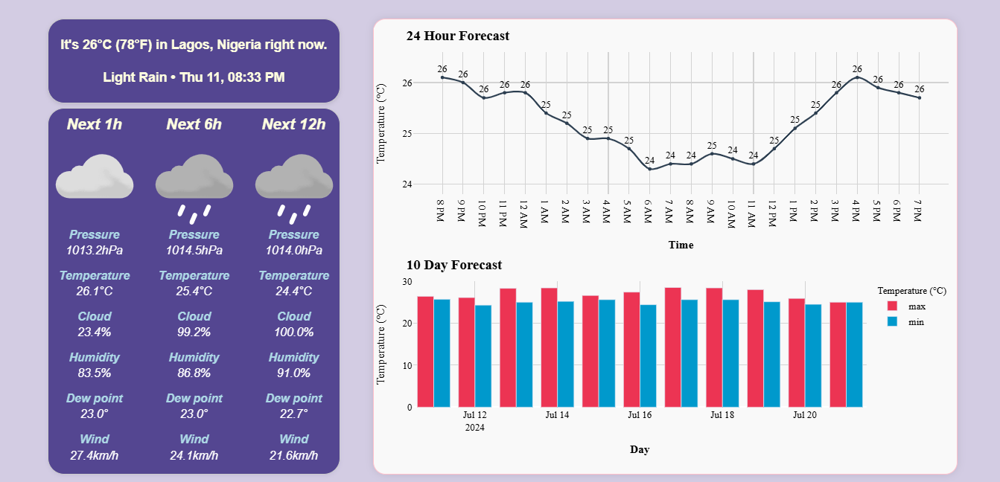

# Weather Application

This is a comprehensive weather application that provides real-time weather forecasts, detailed climatic conditions, and temperature trends. The application utilizes geolocation to provide location-specific weather data.

## Features

- Real-time weather updates
- Detailed climatic conditions including temperature, humidity, wind speed, and cloud fraction
- Weather forecasts for the next 1, 6, and 12 hours
- Visual graphs of temperature trends
- Geolocation-based weather data
- User-friendly interface


The skills and tools primarily used are:

- Python's `requests` package.
- Python's `flask` web framework.
- Python's `Flask-Socketio` client-server communication package.
- Working with JSON.
- Modular programming.
- Javascript's `Plotly.react`
- HTML and CSS
- Object Oriented Programming (OOP)

The application:

1. Fetches a client's IP address.
1. Uses the IP address to look up the client's public location.
1. Provides a weather update for the city the client is in.


## Installation

### Prerequisites

- Python 3.8-3.10
- Pip (Python package installer)

### Setup

1. **Clone the repository:**

    ```sh
    git clone https://github.com/rojuadeyemi/weather-app.git
    cd weather-app
    ```

2. **Create a virtual environment:**

You can use the provided `Makefile` to create a virtual environment by running `make` or `make all`.

You can also create a virtual environment manually using the following approach.

For *Linux/Mac*:

```sh
python -m venv .venv
source .venv/bin/activate 
```

For *Windows*:
    
```sh
python -m venv .venv
.venv\Scripts\activate
```

3. **Install the required dependencies:**

    ```sh
    pip install -U pip
    pip install -r requirements.txt
    ```

## Usage

### Running the Application Locally

To run the *Flask development server*, you can use the command `make develop`. You can also use the following commands:

For *Linux/Mac*:
```sh
export FLASK_APP=weather_app
export FLASK_ENV=development
flask run   
```
For *Windows*:
```sh
set FLASK_APP=weather_app
set FLASK_ENV=development
flask run
```

Then open your web browser and navigate to `<http://127.0.0.1:5000/>` to access the weather application.




This is currently rendered at [MyLocation-app](https://mylocation-app.onrender.com/)
## Acknowledgements
- [ip-api](http://ip-api.com)  for providing geolocation API
- [Met Weather](https://api.met.no/) for providing the weather data API
- [Waitress](https://docs.pylonsproject.org/projects/waitress/en/stable/runner.html) for the WSGI server
- [Render](render.com) for provision of free tier deployment of the app.

## Contributors

Thanks to the following people who have contributed to this project:

* [Aderoju](https://github.com/rojuadeyemi)

## Contact
For any inquiries or support, please contact rojuadeyemi@yahoo.com.
